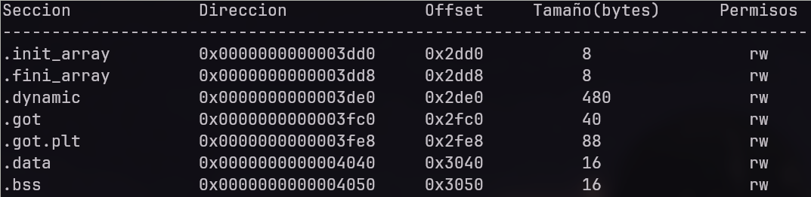

## Nobu-ELF

<p align="center">
  
</p

**ELF parser que permite mostrar las secciones y filtrar por sus permisos o nombre**

Hace uso de elf.h para manipular el archivo ELF

### Uso

```bash
git clone https://github.com/ic4rta/Nobu-ELF.git
gcc nobu-elf.c -o nobu-elf
```

Uso: ./nobu-elf --archivo=\<ELF> [--permisos=\<permisos>] [--nombre=\<nombre_sección>, <nombre_seccion>]

---
Puedes combinar multiples permisos en el argumento ```--permisos```, los permisos validos son:
- r: lectura
- w: escritura
- x: ejecucion

Esta opcion hace match exactamente con las secciones que tengan el permisos especificado, por lo que si pones ```--permisos=x``` te mostrara solo las secciones con permisos de ejecucion, mas no te mostrara las secciones que tengan permisos de ejecucion y otro permiso (la parte de ejemplos se explica mejor)

Tambien puedes filtrar por el nombre de una seccion usando ```--nombre```, pudes especificar mas de una seccion separandolas por una coma
  
#### Ejemplos
- Permisos de lectura: ```nobu-elf --archivo=/ruta/elf --permisos=r```
- Permisos escritura: ```nobu-elf --archivo=/ruta/elf --permisos=w```
- Permisos de lectura y escritura: ```nobu-elf --archivo=/ruta/elf --permisos=rw```
- Permisos de lectura y ejecucion: ```nobu-elf --archivo=/ruta/elf --permisos=rx```
- Filtrar por la seccion .text: ```nobu-elf --archivo=/ruta/elf --nombre=.text```
- Filtrar por la seccion .plt: ```nobu-elf --archivo=/ruta/elf --nombre=.plt```
- Filtrar por la seccion .text e .init: ```nobu-elf --archivo=/ruta/elf --nombre=.text,.init``` 


